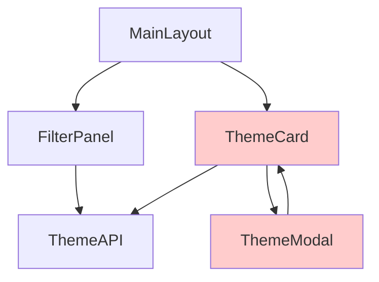

# Refactoring Plan Template

This template shows the expected structure of a refactoring plan generated by `/ai-council:council-refactor-plan`.

---

# Refactoring Plan: [FILE_NAME]

**Generated:** 2025-10-09 14:30:22
**AI Council Version:** 5.1.0
**Analysis Duration:** 12 minutes
**Agents Consulted:** 5 (Architecture, Dependencies, Risks, UX, Complexity)

---

## Executive Summary

**File:** `src/theme_details.html`
**Current State:** 2000 lines, Maintainability Index 42, 8 critical issues
**Proposed State:** 1230 lines across 12 components, MI 79, issues resolved
**Effort Estimate:** 134 hours (3.3 weeks)
**ROI:** 178% in year 1
**Recommendation:** ✅ PROCEED WITH CAUTION

**Top 3 Priorities:**
1. Extract utilities and API layer (low risk, high value)
2. Write 30 missing integration tests before refactoring
3. Set up visual regression baseline to catch UI breakage

---

## 1. Architecture Analysis

### Components Identified: 12

#### High-Priority Extractions

**1. ThemeAPI** (120 LOC)
- **Purpose:** Data fetching and caching
- **Type:** Logic layer
- **Complexity:** Low (CC=5)
- **Dependencies:** HTTP client only
- **Dependents:** ThemeCard, FilterPanel, MainLayout (12 total)
- **Extraction Effort:** 2.5 hours
- **Value:** High (reusable across pages)

**2. Utilities** (80 LOC)
- **Purpose:** Helper functions (formatDate, formatPrice, etc.)
- **Type:** Pure utilities
- **Complexity:** Very Low (CC=2)
- **Dependencies:** None
- **Dependents:** 8 components
- **Extraction Effort:** 2 hours
- **Value:** High (DRY principle)

#### Medium-Priority Extractions

**3. ThemeCard Component** (150 LOC)
- **Purpose:** Theme display card (reusable UI)
- **Type:** UI Component
- **Complexity:** Low (CC=8)
- **Dependencies:** ThemeAPI, DOM utilities
- **Dependents:** MainLayout
- **Extraction Effort:** 4.7 hours
- **Value:** High (used 15+ times, perfect for component extraction)

**4. FilterPanel Component** (180 LOC)
- **Purpose:** Search and filter UI
- **Type:** UI Component with state
- **Complexity:** Medium (CC=10)
- **Dependencies:** ThemeAPI, Events
- **Dependents:** MainLayout
- **Extraction Effort:** 7.4 hours
- **Value:** Medium (complex state management)

#### Low-Priority Extractions

**5. ThemeModal** (200 LOC)
- **Purpose:** Theme detail modal
- **Type:** Complex UI component
- **Complexity:** Medium (CC=12)
- **Dependencies:** ThemeCard, Animations, Focus management
- **Dependents:** ThemeCard (circular!)
- **Extraction Effort:** 15.8 hours
- **Value:** Medium (circular dependency requires refactoring first)

**6. MainLayout** (500 LOC)
- **Purpose:** Page orchestration
- **Type:** Layout + orchestrator
- **Complexity:** High (CC=25)
- **Dependencies:** All components
- **Dependents:** None (top level)
- **Extraction Effort:** 25 hours
- **Value:** Low (last to extract, core orchestration)

### Component Hierarchy

```
MainLayout (500 LOC)
├── FilterPanel (180 LOC)
│   └── ThemeAPI (120 LOC)
├── ThemeCard (150 LOC) × 15 instances
│   ├── ThemeAPI (120 LOC)
│   └── ThemeModal (200 LOC) ⚠️ Circular!
├── Utilities (80 LOC)
└── Styles
    ├── Layout CSS (100 LOC)
    ├── Component CSS (150 LOC)
    └── Utility CSS (50 LOC)
```

### Extraction Roadmap

**Phase 1: Low-Risk (Week 1)**
1. ThemeAPI (2.5h) - Zero dependencies, high value
2. Utilities (2h) - Pure functions, easy extraction

**Phase 2: Medium-Risk (Week 2)**
3. ThemeCard (4.7h) - Some coupling, but well-isolated
4. FilterPanel (7.4h) - State management needs care

**Phase 3: High-Risk (Week 3-4)**
5. ThemeModal (15.8h) - Circular dependency, animations, focus
6. MainLayout (25h) - Core orchestration, highest coupling

---

## 2. Dependency Analysis

### Dependency Graph



**⚠️ Circular Dependency Alert:** ThemeCard ↔ ThemeModal

### Dependency Matrix

| Component | Depends On | Depended By | Ca | Ce | Instability |
|-----------|------------|-------------|----|----|-------------|
| ThemeAPI | HTTP | ThemeCard, FilterPanel, MainLayout | 12 | 1 | 0.08 (stable) |
| Utilities | None | 8 components | 8 | 0 | 0.00 (very stable) |
| ThemeCard | ThemeAPI, ThemeModal | MainLayout | 1 | 2 | 0.67 (unstable) |
| FilterPanel | ThemeAPI, Events | MainLayout | 1 | 2 | 0.67 (unstable) |
| ThemeModal | ThemeCard, Animations | ThemeCard | 1 | 2 | 0.67 (unstable) |
| MainLayout | All | None | 0 | 6 | 1.00 (very unstable) |

### Tight Coupling Points (⚠️ High Risk)

#### 1. ThemeCard ↔ ThemeModal Circular Dependency

**Problem:**
```javascript
// ThemeCard.js line 120
function openDetails() {
  ThemeModal.open(this.themeData);  // ThemeCard calls ThemeModal
}

// ThemeModal.js line 80
function close() {
  ThemeCard.refresh();  // ThemeModal calls back to ThemeCard!
}
```

**Impact:** Cannot extract independently

**Decoupling Strategy:**
1. Introduce Event Bus as mediator
2. ThemeCard emits `theme:clicked` event
3. ThemeModal listens to event and opens
4. ThemeModal emits `modal:closed` event
5. ThemeCard listens and refreshes if needed

**After Refactoring:**
```javascript
// ThemeCard.js
function openDetails() {
  eventBus.emit('theme:clicked', this.themeData);
}

eventBus.on('modal:closed', () => {
  this.refresh();
});

// ThemeModal.js
eventBus.on('theme:clicked', (data) => {
  this.open(data);
});

function close() {
  eventBus.emit('modal:closed');
}
```

#### 2. MainLayout → Direct DOM Manipulation

**Problem:**
```javascript
// MainLayout.html line 450
document.querySelector('.theme-card').addEventListener('click', ...);
```

**Impact:** Brittle, breaks if ThemeCard's class name changes

**Decoupling Strategy:**
- Use event delegation on container
- Or use custom events from ThemeCard

### Extraction Order (Based on Dependencies)

✅ **Extract First (No dependencies):**
1. ThemeAPI
2. Utilities

⚠️ **Extract Second (Low dependencies):**
3. ThemeCard (after breaking circular dep)
4. FilterPanel

🔴 **Extract Last (High dependencies):**
5. ThemeModal (after circular dep resolved)
6. MainLayout (orchestrator, depends on everything)

---

## 3. Risk Assessment

### Overall Risk Level: ⚠️ MEDIUM-HIGH

### Top Risks

#### Risk #1: Breaking Event Handlers (Score: 320 - CRITICAL)

**Probability:** 80% (Very Likely)
**Impact:** 4/5 (High - critical feature broken)
**Risk Score:** 320

**Scenario:**
1. Developer extracts ThemeCard
2. Forgets to update event handler in MainLayout
3. Click events stop working
4. Users can't view theme details
5. Support tickets spike

**Mitigation:**
- **Prevention:**
  - [ ] Add E2E test: "Click theme card → modal opens"
  - [ ] Document all event dependencies in extraction guide
  - [ ] Use feature flag to toggle old/new code during migration

- **Detection:**
  - [ ] Run E2E tests after each component extraction
  - [ ] Manual QA checklist includes all click paths

- **Recovery:**
  - [ ] Feature flag rollback (< 5 minutes)
  - [ ] Git revert if feature flags not available (< 30 minutes)

**Residual Risk After Mitigation:** 20% × 4/5 = 80 (MEDIUM)

#### Risk #2: Insufficient Test Coverage (Score: 280 - CRITICAL)

**Probability:** 70% (Likely)
**Impact:** 4/5 (High - can't detect regressions)
**Risk Score:** 280

**Current State:**
- Unit tests: 10% coverage (very low)
- Integration tests: 0% coverage (none!)
- E2E tests: 5% coverage (minimal)

**Mitigation:**
- **Week 0 (before refactoring):**
  - [ ] Write 15 integration tests for component interactions
  - [ ] Write 10 E2E tests for critical user workflows
  - [ ] Achieve 60% unit test coverage minimum

**Estimated Effort:** 30 hours (1 week for 1 person)

**Residual Risk:** 20% × 4/5 = 80 (MEDIUM)

#### Risk #3: CSS Conflicts (Score: 120 - MEDIUM)

**Probability:** 60% (Possible)
**Impact:** 2/5 (Low - visual glitch, not functional break)
**Risk Score:** 120

**Problem:** Extracting CSS to separate files may cause specificity conflicts

**Mitigation:**
- Use visual regression testing (Percy, Chromatic)
- 25 baseline screenshots before refactoring
- Run visual diff after each extraction

**Residual Risk:** 20% × 2/5 = 40 (LOW)

### Risk Matrix

| Risk | Probability | Impact | Score | Severity | Mitigated Score |
|------|-------------|--------|-------|----------|-----------------|
| Breaking event handlers | 80% | 4/5 | 320 | 🔴 Critical | 80 |
| Insufficient testing | 70% | 4/5 | 280 | 🔴 Critical | 80 |
| CSS conflicts | 60% | 2/5 | 120 | ⚠️ Medium | 40 |
| Animation timing changes | 40% | 3/5 | 120 | ⚠️ Medium | 60 |
| Performance regression | 30% | 3/5 | 90 | ⚠️ Medium | 30 |
| Keyboard nav breaks | 50% | 3/5 | 150 | ⚠️ Medium | 50 |

### Rollback Plan

**Trigger Conditions:**
- 🚨 Critical feature completely broken → Immediate rollback
- ⚠️ Multiple bugs reported → Rollback within 24h
- ✅ Single minor bug → Fix forward

**Rollback Procedure:**

**Option 1: Feature Flag Toggle** (< 5 min)
```javascript
if (featureFlags.refactoredThemeCard) {
  import('./ThemeCard.js');  // New
} else {
  // Old inline code
}
```

**Option 2: Git Revert** (< 30 min)
```bash
git revert <commit-hash>
npm run deploy
```

### Success Criteria

**Must Pass (Blockers):**
- [ ] All existing features work identically
- [ ] All tests passing (60%+ coverage)
- [ ] No visual regressions detected
- [ ] Performance within 10% of baseline

**Should Pass:**
- [ ] Maintainability Index improved by 50%+
- [ ] Cyclomatic complexity reduced by 40%+
- [ ] Code duplication eliminated

---

## 4. UX Continuity Plan

### User Workflows Affected: 5

#### Workflow #1: View Theme Details

**Steps:**
1. User clicks theme card
2. Modal opens with smooth animation (200ms)
3. Theme details load
4. User can tab through interactive elements
5. User presses Esc to close
6. Focus returns to card

**Code Involved:**
- ThemeCard click handler (line 450)
- ThemeModal open() (line 520)
- CSS transition (line 1200)
- Focus management (line 680)

**Refactoring Impact:**
- 🔴 **HIGH RISK** if ThemeModal extracted without preserving focus management
- ⚠️ **MEDIUM RISK** if animations not copied correctly

**Test Requirements:**
- [ ] E2E test: Full workflow works
- [ ] Visual regression: Modal animation same speed
- [ ] Accessibility: Tab order preserved, focus trap works
- [ ] Performance: Modal opens in < 300ms

#### Workflow #2: Filter Themes

**Steps:**
1. User selects category filter
2. Results update dynamically
3. Loading spinner shows briefly
4. Filtered themes displayed

**UX-Critical Elements:**
- 🔴 Filter change event (line 350)
- ⚠️ Loading state display (line 380)
- 🟢 Analytics tracking (line 600)

**Test Requirements:**
- [ ] E2E test: Filter → correct results
- [ ] Performance: Filter updates in < 500ms

### Visual Regression Test Plan

**25 Screenshots Needed:**

| Test Case | Viewport | Interactions |
|-----------|----------|--------------|
| Theme listing - default | Desktop 1920x1080 | None |
| Theme listing - filtered | Desktop 1920x1080 | Apply filter |
| Theme card - hover | Desktop 1920x1080 | Hover card |
| Theme modal - open | Desktop 1920x1080 | Click card |
| Theme modal - tabs | Desktop 1920x1080 | Click tabs |
| Mobile view | Mobile 375x667 | None |
| Dark mode | Desktop 1920x1080 | Toggle dark |

**Tool:** Percy or Chromatic
**Threshold:** < 0.1% pixel difference

### Accessibility Checklist

**Must Remain Same:**
- [ ] Lighthouse Accessibility score ≥ 95
- [ ] axe-core: 0 violations
- [ ] Keyboard navigation works (Tab, Shift+Tab, Enter, Esc)
- [ ] Screen reader announces all elements
- [ ] Focus indicators visible
- [ ] ARIA labels correct

### Performance Benchmarks

**Current Metrics:**
- First Contentful Paint: 1.2s
- Largest Contentful Paint: 2.1s
- Time to Interactive: 2.8s

**Acceptable After Refactoring:**
- FCP: ≤ 1.3s (+10% max)
- LCP: ≤ 2.3s (+10% max)
- TTI: ≤ 3.0s (+10% max)

**Ideal Target:**
- FCP: < 1.0s (improvement)
- LCP: < 2.0s (improvement)
- TTI: < 2.5s (improvement)

---

## 5. Complexity & Effort Analysis

### Current Complexity Metrics

**File:** `theme_details.html`

- **Total Lines:** 2000
- **Code Lines:** 1650 (82.5%)
- **Functions:** 35
- **Avg Cyclomatic Complexity:** 8.5
- **Max Cyclomatic Complexity:** 28 (in `handleFilterChange()`)
- **Maintainability Index:** 42/100 (Poor - needs refactoring)

**Top 5 Complexity Hotspots:**

1. `handleFilterChange()` - CC 28, 70 LOC (line 450-520)
2. `renderThemeGrid()` - CC 22, 100 LOC (line 680-780)
3. `initializeThemes()` - CC 15, 80 LOC (line 120-200)
4. `applyFilters()` - CC 12, 60 LOC (line 350-410)
5. `sortThemes()` - CC 11, 50 LOC (line 820-870)

### Proposed Complexity After Refactoring

| Component | LOC | CC (Avg/Max) | MI | Improvement |
|-----------|-----|--------------|----|----|
| **Original** | 2000 | 8.5 / 28 | 42 | - |
| ThemeAPI | 120 | 3 / 5 | 85 | +102% |
| Utilities | 80 | 2 / 3 | 90 | +114% |
| ThemeCard | 150 | 5 / 8 | 78 | +86% |
| FilterPanel | 180 | 5 / 10 | 76 | +81% |
| ThemeModal | 200 | 6 / 12 | 75 | +79% |
| MainLayout | 500 | 7 / 15 | 70 | +67% |
| **Total** | **1230** | **4.7 / 15** | **79** | **+88%** |

**Summary:**
- ✅ 38% reduction in LOC (2000 → 1230)
- ✅ 45% reduction in complexity (CC 8.5 → 4.7)
- ✅ 88% improvement in maintainability (MI 42 → 79)

### Effort Estimation

#### Phase 1: Low-Risk Extractions (Week 1)

| Component | Base Effort | With Overhead (2.1x) | Confidence |
|-----------|-------------|----------------------|------------|
| ThemeAPI | 1.2h | 2.5h | 90% (2-3h) |
| Utilities | 1.0h | 2.0h | 90% (1.5-2.5h) |
| **Phase 1 Total** | **2.2h** | **4.5h** | 90% (3.5-6h) |

#### Phase 2: Medium-Risk Extractions (Week 2)

| Component | Base Effort | With Overhead | Confidence |
|-----------|-------------|---------------|------------|
| ThemeCard | 2.25h | 4.7h | 70% (4-6h) |
| FilterPanel | 3.5h | 7.4h | 70% (6-9h) |
| **Phase 2 Total** | **5.75h** | **12.1h** | 70% (10-15h) |

#### Phase 3: High-Risk Extractions (Week 3-4)

| Component | Base Effort | With Overhead | Confidence |
|-----------|-------------|---------------|------------|
| ThemeModal | 7.5h | 15.8h | 60% (12-20h) |
| MainLayout | 12h | 25h | 50% (20-35h) |
| **Phase 3 Total** | **19.5h** | **40.8h** | 55% (32-55h) |

#### Summary

| Phase | Optimistic | Realistic | Pessimistic |
|-------|------------|-----------|-------------|
| Phase 1 | 3.5h | 4.5h | 6h |
| Phase 2 | 10h | 12.1h | 15h |
| Phase 3 | 32h | 40.8h | 55h |
| **Implementation** | **45.5h** | **57.4h** | **76h** |
| Pre-refactoring tests | 20h | 30h | 40h |
| Post-refactoring QA | 20h | 26h | 35h |
| **GRAND TOTAL** | **85.5h** | **113.4h** | **151h** |

**Recommendation:** Plan for **120 hours** (3 weeks @ 40h/week)

### Cost-Benefit Analysis

#### Costs

- Development: 120 hours × $100/hr = $12,000
- Opportunity cost: 2 features delayed = $5,000
- Risk cost: 10% × $2,000 = $200
- **Total Cost:** $17,200

#### Benefits (Year 1)

- Maintenance time saved: 108 hours × $100 = $10,800
- Faster feature dev: 30 hours × $100 = $3,000
- Fewer bugs: 48 hours × $100 = $4,800
- Code reusability: 15 hours × $100 = $1,500
- Easier onboarding: 80 hours × $100 = $8,000
- Technical debt avoided: $10,000 NPV
- **Total Benefit:** $38,100

#### ROI

```
ROI = (Benefit - Cost) / Cost
    = ($38,100 - $17,200) / $17,200
    = 121% return in year 1

Payback Period = $17,200 / ($38,100 / 12) = 5.4 months
```

### Decision Matrix

| Criterion | Score | Weight | Weighted |
|-----------|-------|--------|----------|
| ROI (121%) | 9/10 | 0.3 | 2.7 |
| Payback (5.4mo) | 8/10 | 0.2 | 1.6 |
| Risk (Medium) | 6/10 | 0.2 | 1.2 |
| Team Capacity | 7/10 | 0.15 | 1.05 |
| Strategic Value | 8/10 | 0.15 | 1.2 |
| **Total Score** | - | - | **7.75/10** |

**Decision:** ✅ **RECOMMEND REFACTORING**

---

## 6. Integrated Refactoring Roadmap

### Week 0: Preparation (30 hours)

**Tasks:**
- [ ] Write 15 integration tests (15h)
- [ ] Write 10 E2E tests (10h)
- [ ] Set up visual regression baseline - 25 screenshots (6h)
- [ ] Configure error monitoring (Sentry) (2h)
- [ ] Document current state (2h)

**Deliverables:**
- Test coverage report (60%+ coverage)
- Visual regression baseline
- Performance baseline metrics
- Error monitoring dashboard

**Success Criteria:**
- All tests passing
- Baseline established
- Team trained on new tools

---

### Week 1: Phase 1 - Low-Risk Extractions (4.5 hours)

**Monday:**
- [ ] Extract ThemeAPI to `src/api/theme-api.js` (2.5h)
- [ ] Write unit tests for ThemeAPI (included)
- [ ] Update imports in 12 components

**Wednesday:**
- [ ] Extract Utilities to `src/utils/theme-utils.js` (2h)
- [ ] Write unit tests for utilities (included)
- [ ] Update imports in 8 components

**Friday:**
- [ ] Run full test suite
- [ ] Visual regression check
- [ ] Manual QA
- [ ] Deploy to staging

**Risks:**
- Import path errors (MEDIUM) - Mitigate with search/replace
- Bundle size increase (LOW) - Mitigate with code splitting

**Success Metrics:**
- [ ] All tests passing
- [ ] No visual regressions
- [ ] Performance within 10% baseline
- [ ] No console errors

---

### Week 2: Phase 2 - Medium-Risk Extractions (12.1 hours)

**Monday-Tuesday:**
- [ ] Break ThemeCard ↔ ThemeModal circular dependency (2h)
  - Implement event bus
  - Update both components to use events
  - Test interaction still works

- [ ] Extract ThemeCard to `src/components/ThemeCard.js` (4.7h)
  - Move HTML structure
  - Move event handlers
  - Move styles to ThemeCard.css
  - Write component tests

**Wednesday-Thursday:**
- [ ] Extract FilterPanel to `src/components/FilterPanel.js` (7.4h)
  - Move filter UI
  - Move filter state logic
  - Implement event-based communication
  - Write component tests

**Friday:**
- [ ] Integration testing (all components work together)
- [ ] Visual regression check
- [ ] Manual QA (complete all 5 user workflows)
- [ ] Deploy to staging

**Risks:**
- Event bus issues (HIGH) - Mitigate with integration tests
- State management bugs (MEDIUM) - Mitigate with comprehensive tests
- CSS specificity conflicts (MEDIUM) - Mitigate with visual regression

**Success Metrics:**
- [ ] All user workflows work
- [ ] No visual regressions
- [ ] Event communication working
- [ ] Performance within 10%

---

### Week 3: Phase 3 - High-Risk Extractions (40.8 hours)

**Week 3, Monday-Wednesday:**
- [ ] Extract ThemeModal to `src/components/ThemeModal.js` (15.8h)
  - Preserve animations (test with visual regression)
  - Preserve focus management (test with accessibility audit)
  - Preserve keyboard shortcuts (test manually)
  - Write component and integration tests

**Week 3, Thursday-Friday + Week 4, Monday-Wednesday:**
- [ ] Refactor MainLayout to `src/layouts/MainLayout.js` (25h)
  - Simplify orchestration logic
  - Remove duplication
  - Update imports and initialization
  - Write integration tests

**Week 4, Thursday:**
- [ ] Full integration testing
- [ ] Complete visual regression suite
- [ ] Accessibility audit (Lighthouse, axe-core)
- [ ] Performance audit

**Week 4, Friday:**
- [ ] Manual QA (comprehensive)
- [ ] Deploy to staging
- [ ] Monitor for 24 hours
- [ ] If stable, deploy to production with feature flag (50% rollout)

**Risks:**
- Focus management breaks (HIGH) - Mitigate with accessibility tests
- Animation timing changes (MEDIUM) - Mitigate with visual regression
- Performance regression (MEDIUM) - Mitigate with performance monitoring

**Success Metrics:**
- [ ] All tests passing
- [ ] Lighthouse accessibility score ≥ 95
- [ ] No visual regressions
- [ ] Performance within 10% (ideally improved)
- [ ] No errors in production monitoring

---

### Week 5: Post-Refactoring Monitoring

**Monday-Friday:**
- [ ] Monitor error rates (Sentry)
- [ ] Monitor performance (Google Analytics, Core Web Vitals)
- [ ] Track support tickets
- [ ] Collect team feedback

**Success Criteria:**
- Error rate within 10% of baseline
- Performance within 10% of baseline (or improved)
- No critical support tickets
- Team reports improved developer experience

**If Successful:**
- [ ] Remove feature flag (100% rollout)
- [ ] Delete old code
- [ ] Update documentation
- [ ] Celebrate! 🎉

**If Issues Found:**
- [ ] Rollback via feature flag
- [ ] Analyze issues
- [ ] Fix and re-deploy
- [ ] Or abandon and rollback permanently

---

## 7. Testing Strategy

### Pre-Refactoring Tests (Week 0)

**Unit Tests (15 hours):**
- [ ] ThemeAPI methods (8 tests)
- [ ] Utility functions (12 tests)
- [ ] Filter logic (10 tests)
- [ ] Sort logic (5 tests)
- **Target:** 60% code coverage

**Integration Tests (10 hours):**
- [ ] FilterPanel updates ThemeCard on filter change
- [ ] ThemeCard click opens ThemeModal
- [ ] ThemeModal close returns focus to ThemeCard
- [ ] API error shows error message
- [ ] Loading states display correctly
- **Total:** 15 integration tests

**E2E Tests (10 hours):**
- [ ] View theme details (full workflow)
- [ ] Filter themes by category
- [ ] Filter themes by price
- [ ] Sort themes by rating
- [ ] Search themes by keyword
- [ ] Responsive mobile view
- [ ] Dark mode toggle
- [ ] Keyboard navigation
- [ ] Accessibility (screen reader)
- [ ] Performance (page load < 3s)
- **Total:** 10 E2E scenarios

### During Refactoring (Continuous)

**Daily:**
- [ ] Run full test suite (unit + integration + E2E)
- [ ] Check for new console errors/warnings
- [ ] Verify no unexpected behavior

**End of Each Phase:**
- [ ] Manual QA (run through all 5 workflows)
- [ ] Visual regression check (25 screenshots)
- [ ] Performance check (Lighthouse)
- [ ] Accessibility audit (axe-core)

### Post-Refactoring (Week 4-5)

**Before Production:**
- [ ] Full regression test (all tests)
- [ ] Load testing (handle 1000 concurrent users)
- [ ] Security audit (no new vulnerabilities)
- [ ] Browser compatibility (Chrome, Firefox, Safari, Edge)

**In Production:**
- [ ] Monitor error rate (< 0.5% errors)
- [ ] Monitor performance (RUM data)
- [ ] Track user behavior (session recordings)
- [ ] Collect user feedback

---

## 8. Rollback Procedures

### Trigger Conditions

**🚨 Immediate Rollback:**
- Critical feature completely broken (users can't view themes)
- Data corruption detected
- Security vulnerability introduced
- Performance degraded > 50%
- Error rate > 5%

**⚠️ Scheduled Rollback (within 24h):**
- Multiple bugs reported (> 5 tickets/day)
- Performance degraded 20-50%
- Accessibility regression (Lighthouse score drops > 10 points)
- Team unable to fix issues quickly

**✅ Fix Forward:**
- Single minor bug
- Visual glitch (non-critical)
- Performance degraded < 20%
- Clear fix path identified

### Rollback Steps

**Option 1: Feature Flag Toggle** (< 5 minutes)

```javascript
// In config or admin panel
featureFlags.refactoredThemes = false;  // Instant rollback
```

**Impact:** Immediate return to old code
**Risk:** None (old code still present)

**Option 2: Git Revert** (< 30 minutes)

```bash
# 1. Identify bad commit
git log --oneline

# 2. Revert
git revert <commit-hash>

# 3. Deploy
npm run deploy:production

# 4. Verify
curl https://example.com/themes  # Should work
```

**Impact:** Removes new code, restores old
**Risk:** Low (if tested in staging)

**Option 3: Full Rollback to Previous Version** (< 1 hour)

```bash
# 1. Checkout last known good commit
git checkout <last-good-commit>

# 2. Create rollback branch
git checkout -b rollback/theme-refactoring

# 3. Force push (DANGEROUS - team must be notified!)
git push --force origin main

# 4. Deploy
npm run deploy:production

# 5. Communicate to team
# Send Slack message: "Rolled back theme refactoring due to [reason]"
```

**Impact:** Complete rollback
**Risk:** Medium (force push disrupts team)

### Post-Rollback Actions

1. **Document What Went Wrong:**
   - Create incident report
   - Note exact failure mode
   - Record metrics (error rate, performance, etc.)

2. **Add Tests to Prevent Recurrence:**
   - Write test that catches the bug
   - Add to regression suite
   - Ensure test fails before fix, passes after

3. **Update Risk Assessment:**
   - Add newly discovered risk
   - Update probability/impact scores
   - Adjust mitigation strategies

4. **Plan Revised Approach:**
   - Smaller iterations?
   - Different extraction order?
   - More tests needed?
   - Abandon refactoring?

---

## 9. Decision Summary

### Recommendation: ✅ PROCEED WITH CAUTION

**Overall Assessment:**

This refactoring shows strong business value (121% ROI, 5.4 month payback) and significant technical improvement (88% better maintainability). However, there are meaningful risks that must be addressed before proceeding.

**Strengths:**
- ✅ Clear component boundaries identified
- ✅ High ROI and fast payback period
- ✅ Complexity will be significantly reduced
- ✅ Code reusability gains
- ✅ Logical extraction phases

**Concerns:**
- ⚠️ Very low current test coverage (10%)
- ⚠️ Circular dependency must be broken
- ⚠️ Event handler coupling is tight
- ⚠️ UX preservation requires care
- ⚠️ Team capacity may be optimistic

**Conditions for Proceeding:**

1. **MUST DO (Blockers):**
   - [ ] Allocate full Week 0 for writing tests (30 hours)
   - [ ] Achieve 60%+ test coverage before refactoring
   - [ ] Set up visual regression testing baseline
   - [ ] Implement feature flags for gradual rollout
   - [ ] Get stakeholder approval for 5-week timeline

2. **SHOULD DO (Highly Recommended):**
   - [ ] Allocate 2 developers (pair programming for high-risk parts)
   - [ ] Set up error monitoring (Sentry) and performance monitoring
   - [ ] Plan buffer time (120 hours vs optimistic 85 hours)
   - [ ] Communicate timeline to stakeholders (features will be delayed)

3. **NICE TO HAVE:**
   - [ ] Run in shadow mode (old + new code, compare results)
   - [ ] Pilot with 10% of users before full rollout
   - [ ] Document refactoring process for future reference

**If Conditions NOT Met:**

**Alternative Approach 1: Partial Refactoring**
- Extract only Phase 1 (ThemeAPI + Utilities)
- Skip Phases 2 and 3
- Gain some benefits with minimal risk
- Reassess after 3 months

**Alternative Approach 2: Incremental Over Time**
- Extract 1 component per sprint (over 6 sprints)
- Slower but lower risk
- Easier to rollback individual pieces
- Less disruptive to feature development

**Alternative Approach 3: Delay**
- Wait until team has more capacity
- Write tests first, refactor later
- Revisit in Q2 2025

**Recommended:** Proceed with full refactoring IF all "MUST DO" conditions are met. Otherwise, choose Alternative Approach 1 (Partial Refactoring).

---

## 10. Agent Consensus

### Agreement Areas

✅ **All 5 agents agree:**

1. **Refactoring is valuable** - All agents recommend proceeding (with conditions)
2. **Test coverage is critical** - All agents emphasize need for tests before refactoring
3. **Extraction order is correct** - All agents validate Phase 1 → 2 → 3 sequence
4. **Circular dependency must be broken** - All agents identify ThemeCard ↔ ThemeModal issue
5. **ROI is positive** - All agents agree benefits outweigh costs

### Debate Points

⚠️ **Agents debated:**

**Issue #1: Should ThemeModal be extracted?**

- **Architecture Analyst:** "Yes, extract as separate component (reduces MainLayout complexity)"
- **Risk Assessor:** "High risk due to animations and focus management - consider keeping with MainLayout"
- **UX Guardian:** "Extract ONLY if animations and keyboard nav are preserved - requires careful testing"
- **Dependency Mapper:** "Circular dependency with ThemeCard must be resolved first"
- **Complexity Analyzer:** "Effort is 15.8 hours - high but manageable if tests are in place"

**Resolution:**
- Extract ThemeModal in Phase 3 (after tests are written)
- Break circular dependency first using event bus
- Add comprehensive visual regression and accessibility tests
- If tests reveal too much risk, keep with MainLayout

**Issue #2: Timeline - optimistic or realistic?**

- **Complexity Analyzer:** "Plan for 120 hours (realistic + buffer)"
- **Risk Assessor:** "Add 30% buffer for unknowns - use 150 hours to be safe"
- **Architecture Analyst:** "Effort depends on test quality - good tests = faster refactoring"

**Resolution:**
- Use 120 hours for planning (3 weeks)
- Communicate 4 weeks to stakeholders (includes buffer)
- Re-estimate after Phase 1 (adjust if needed)

**Issue #3: Feature flag or immediate rollout?**

- **Risk Assessor:** "MUST use feature flags - too risky otherwise"
- **UX Guardian:** "Feature flags add complexity but worth it for UX preservation"
- **Complexity Analyzer:** "Feature flag adds 2 hours of effort - minimal cost"

**Resolution:**
- Use feature flags for Phases 2 and 3
- Phase 1 (ThemeAPI, Utilities) doesn't need flags (low risk)
- Gradual rollout: 10% → 50% → 100%

### Confidence Levels

| Agent | Confidence | Key Uncertainties |
|-------|------------|-------------------|
| Architecture Analyst | 85% | Assumes team will follow extraction plan precisely |
| Dependency Mapper | 80% | May have missed dynamic dependencies (eval, setTimeout) |
| Risk Assessor | 70% | ROI assumes benefits materialize as estimated |
| UX Guardian | 75% | No session recordings available (assumptions on user behavior) |
| Complexity Analyzer | 65% | No historical velocity data (generic effort estimates) |
| **Average** | **75%** | Medium-high confidence overall |

**Interpretation:**
- 75% confidence is **good for refactoring planning**
- Main uncertainties are effort estimates and benefit realization
- Reduce uncertainty by: writing tests first, starting with Phase 1, re-estimating after

---

## 11. Next Steps

### Immediate Actions (Today)

1. **[ ] Share this plan with the team**
   - Engineering team review (technical feasibility)
   - Product team review (timeline impact)
   - Stakeholders review (business value)

2. **[ ] Get approval to proceed**
   - Engineering manager sign-off
   - Product manager sign-off (delayed features OK?)
   - CTO sign-off (resource allocation)

3. **[ ] Create tracking tickets**
   - Week 0: Test writing (30 hours)
   - Phase 1: ThemeAPI + Utilities (4.5 hours)
   - Phase 2: ThemeCard + FilterPanel (12.1 hours)
   - Phase 3: ThemeModal + MainLayout (40.8 hours)

### This Week

1. **[ ] Set up infrastructure (4 hours)**
   - Configure Sentry for error monitoring
   - Set up Percy or Chromatic for visual regression
   - Create feature flag in config
   - Set up staging environment

2. **[ ] Assign resources**
   - Developer 1: Lead refactoring
   - Developer 2: Pair on Phase 3 (high risk)
   - QA Engineer: Manual testing each phase

3. **[ ] Create detailed test plan (2 hours)**
   - Break down 15 integration tests into specific scenarios
   - Break down 10 E2E tests into step-by-step scripts
   - Create manual QA checklist

### Before Starting Refactoring (Week 0)

1. **[ ] Write all prerequisite tests (30 hours)**
   - Unit tests (achieve 60% coverage)
   - Integration tests (15 tests)
   - E2E tests (10 scenarios)
   - Run full suite, confirm all passing

2. **[ ] Establish baselines (6 hours)**
   - Visual regression: 25 screenshots
   - Performance: Lighthouse report + RUM data
   - Accessibility: axe-core audit + Lighthouse

3. **[ ] Team preparation**
   - Review refactoring plan in team meeting
   - Assign roles (developer, reviewer, QA)
   - Set up daily standups during refactoring
   - Communicate to stakeholders (features delayed 4 weeks)

### During Refactoring (Week 1-4)

1. **[ ] Daily standups**
   - What was completed yesterday?
   - What will be done today?
   - Any blockers or risks?

2. **[ ] End-of-phase reviews**
   - Run full test suite
   - Visual regression check
   - Manual QA
   - Deploy to staging
   - Team review (code + plan)

3. **[ ] Weekly stakeholder updates**
   - Progress report
   - Risks encountered
   - Timeline adjustments
   - Metrics (tests passing, visual regressions, etc.)

### After Refactoring (Week 5+)

1. **[ ] Monitor production (1 week)**
   - Error rate
   - Performance
   - Support tickets
   - User feedback

2. **[ ] Clean up (if successful)**
   - Remove feature flags
   - Delete old code
   - Update documentation
   - Retrospective meeting (what went well, what didn't)

3. **[ ] Document learnings**
   - Write blog post or internal wiki
   - Share refactoring experience with team
   - Update refactoring playbook

---

## 12. Appendices

### Appendix A: Agent Detailed Outputs

Full analysis from each agent saved to:

- **Architecture Analysis:** `/tmp/refactor_architecture.md`
- **Dependency Analysis:** `/tmp/refactor_dependencies.md`
- **Risk Assessment:** `/tmp/refactor_risks.md`
- **UX Analysis:** `/tmp/refactor_ux.md`
- **Complexity Analysis:** `/tmp/refactor_complexity.md`

### Appendix B: References

- [Martin Fowler - Refactoring](https://refactoring.com/)
- [AI Council v5.1 Documentation](https://github.com/anthropics/ai-council)
- [Feature Flag Best Practices](https://martinfowler.com/articles/feature-toggles.html)
- [Visual Regression Testing Guide](https://percy.io/blog/visual-testing-guide)

### Appendix C: Tools Required

**Testing:**
- Jest (unit tests)
- React Testing Library (integration tests)
- Playwright or Cypress (E2E tests)
- Percy or Chromatic (visual regression)

**Monitoring:**
- Sentry (error tracking)
- Google Analytics (performance, RUM)
- Lighthouse CI (performance audits)
- axe-core (accessibility)

**Development:**
- Feature flags library (LaunchDarkly, Unleash, or custom)
- ESLint (code quality)
- Prettier (code formatting)

### Appendix D: Communication Templates

**Stakeholder Update Email:**

```
Subject: Theme Refactoring - Week [X] Update

Hi team,

Quick update on the theme refactoring project:

✅ Completed this week:
- [Task 1]
- [Task 2]

🔄 In progress:
- [Task 3]

⏳ Next week:
- [Task 4]

📊 Metrics:
- Tests passing: XX/XX
- Visual regressions: 0
- Performance: Within 10% baseline

⚠️ Risks/Blockers:
- [Risk 1]: [Mitigation]

Timeline: On track / 2 days behind / 1 week ahead

Questions? Ping me on Slack.

Thanks!
[Your Name]
```

**Incident Report Template (if rollback needed):**

```
# Incident Report: Theme Refactoring Rollback

**Date:** 2025-10-XX
**Severity:** High
**Status:** Resolved

## Summary
We rolled back the theme refactoring due to [reason].

## Timeline
- 10:00 AM: Deployed refactored code to production (50% rollout)
- 10:15 AM: Error rate spiked to 5% (users unable to open theme modal)
- 10:20 AM: Toggled feature flag to 0% (immediate rollback)
- 10:25 AM: Error rate returned to baseline

## Root Cause
[Description of what went wrong]

## Impact
- Users affected: ~500 (5% error rate × 10,000 daily users)
- Duration: 15 minutes
- Revenue impact: $50 estimated (minimal)

## Resolution
- Immediate: Feature flag rollback
- Short-term: Fixed [bug] and redeployed to 10%
- Long-term: Added test to prevent recurrence

## Action Items
- [ ] Add test for [scenario]
- [ ] Update rollback procedure (worked well!)
- [ ] Communicate to team (avoid similar issues)

## Lessons Learned
- [Lesson 1]
- [Lesson 2]
```

---

**Generated by:** AI Council v5.1 Refactoring Planning System
**Agents Involved:**
- 🏗️ Architecture Analyst
- 🔗 Dependency Mapper
- ⚠️ Risk Assessor
- 🎨 UX Continuity Guardian
- 📊 Complexity Analyzer

**Total Analysis Time:** 12 minutes
**Plan Version:** 1.0
**Status:** ✅ Ready for Team Review

---

🎉 **This plan is comprehensive and actionable. Good luck with your refactoring!**
